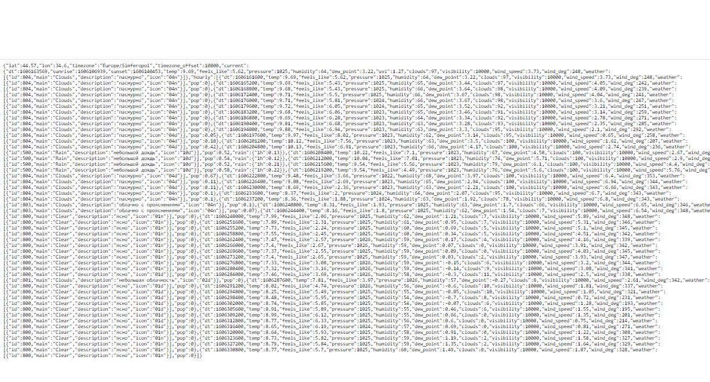
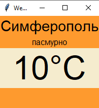

<p align="center">МИНИСТЕРСТВО НАУКИ  И ВЫСШЕГО ОБРАЗОВАНИЯ РОССИЙСКОЙ ФЕДЕРАЦИИ<br>

Федеральное государственное автономное образовательное учреждение высшего образования<br>

"КРЫМСКИЙ ФЕДЕРАЛЬНЫЙ УНИВЕРСИТЕТ им. В. И. ВЕРНАДСКОГО"<br>

ФИЗИКО-ТЕХНИЧЕСКИЙ ИНСТИТУТ<br>

Кафедра компьютерной инженерии и моделирования</p>

<br>

<h3 align="center">Отчёт по лабораторной работе № X<br> по дисциплине "Программирование"</h3>

<br><br>

<p>студента 1 курса группы ПИ-б-о-202(2)<br>

Лыжин Игорь Дмитриевич<br>

направления подготовки 09.03.0X "Программная инженерия"</p>

<br><br>

<table>

<tr><td>Научный руководитель<br> старший преподаватель кафедры<br> компьютерной инженерии и моделирования</td>

<td>(оценка)</td>

<td>Чабанов В.В.</td>

</tr>

</table>

<br><br>

<p align="center">Симферополь, 2020</p>

<hr>

 Цель:
 

1. Закрепить навыки разработки многофайловыx приложений;
2.  Изучить способы работы с API web-сервиса;
3.  Изучить процесс сериализации/десериализации данных в/из json;
4.  Получить базовое представление о сетевом взаимодействии приложений;

## Выполнение работы

### Задание 1

Заходим на сайт http://openweathermap.org далее регистрируемся. Генерируем API key: 0d58c50a9d9b684efce1459b5c0481b8

Далее подставляем наш API key в ссылку, которая имеет следующий вид.

http://api.openweathermap.org/data/2.5/onecall?&appid=0d58c50a9d9b684efce1459b5c0481b8

Переходим по созданной ссылке и получаем результат в виде JSON кода.

Для получения прогноза погоды для Симферополя с почасовым интервалом необходимо отправить запрос : /data/2.5/onecall?lat=44.57&lon=34.6&lang=ru&exclude=daily&units=metric&appid=0d58c50a9d9b684efce1459b5c0481b8



<center> <i> Рисунок 1.1. Полученный запрос с сайта для формата JSON. </center>

### Задание 2

Чтобы получить текущее время в формате json необходимо отправить запрос на сайт worldtimeapi.org. 
Запрос для получение Симферопольского время будет выглядеть так : http://worldtimeapi.org/api/timezone/Europe/Simferopol.

### Полный исходный код серверного приложения:

```c++
#include <fstream>
#include <iostream>
#include <cpp_httplib/httplib.h>
#include <string>
#include <nlohmann/json.hpp>
using json = nlohmann::json;
using namespace httplib;
json jax;
void gen_response(const Request& req, Response& ress) {
    std::string str;
    int unixtime = 0, mix = 0, dan = 0,uno = 0;
    json j, j2;
    std::ifstream l("weathernow.html");
    Client cli2("http://worldtimeapi.org");
    auto res2 = cli2.Get("/api/timezone/Europe/Simferopol");
    if (res2) {
        if (res2->status == 200) {
             j2 = json::parse(res2->body);
            unixtime = j2["unixtime"].get<int>();

        }
        else {
            std::cout << "Status code: " << res2->status << std::endl;
        }
    }
    else {
        auto err2 = res2.error();
        std::cout << "Error code: " << err2 << std::endl;
    }
    Client cli("http://api.openweathermap.org");
    auto res = cli.Get("/data/2.5/onecall?lat=44.57&lon=34.6&lang=ru&exclude=daily&units=metric&appid=0d58c50a9d9b684efce1459b5c0481b8");
    if (res) {
        if (res->status == 200) {
             j = json::parse(res->body);
            mix = j["hourly"][j["hourly"].size()-1]["dt"].get<int>();
            for (int i = j["hourly"].size(); i >0; --i) {
                    
                    for (int p = 0; p < j["hourly"].size(); p++) {
                        if (mix > unixtime and  j["hourly"][p]["dt"]<= mix) {
                            dan = j["hourly"][p]["dt"];
                            mix = dan;
                            uno = p;
                        }
                    }
                
            }
           
        }
        else {
            std::cout << "Status code: " << res->status << std::endl;
        }
    }
    else {
        auto err = res.error();
        std::cout << "Error code: " << err << std::endl;
    }
    jax["description"] = j["hourly"][uno]["weather"][0]["description"];
    jax["temp"] = std::to_string(j["hourly"][uno]["temp"].get<int>());
    std::getline(l, str, '\0'); 
    while (str.find("{hourly[i].temp}") != std::string::npos)
            str.replace(str.find("{hourly[i].temp}"), 16, std::to_string(j["hourly"][uno]["temp"].get<int>()));
        str.replace(str.find("{hourly[i].weather[0].description}"), 34, j["hourly"][uno]["weather"][0]["description"]);
        str.replace(str.find("{hourly[i].weather[0].icon}"), 27, j["hourly"][uno]["weather"][0]["icon"]);
    ress.set_content(str, "text/html");
}
void gen_raw(const Request& req, Response& ress) {
    Client("http://localhost:3000").Get("/");
    ress.set_content(jax.dump(4), "text/json");
}
int main() {
	Server svr;
    svr.Get("/raw", gen_raw);
	svr.Get("/", gen_response); 
	std::cout << "Start server... OK\n";
	svr.listen("localhost",3000); 

```

### Полный исходный код клиентского приложения:

```python
from tkinter import *
import json
import requests

def right_click(event):
	try:
		response = requests.get('http://localhost:3000/raw').content 
		j = json.loads(response)
		jWeather.configure(text=str(j["description"]))
		jText.configure(text=str(j["temp"]) + "°C")
	except requests.exceptions.ConnectionError :
		pass

root = Tk()

root.title("Weathe_now")
root.bind("<Button-3>", right_click)

frame1_1 = Frame(root, bg="#FE9A2E", width=1, height=1)
frame1_1.pack(side=TOP, fill=X)

frame2_2 = Frame(root, bg="#F5ECCE",  width=1, height=1)
frame2_2.pack(expand=1, fill=BOTH)

frame3_3 = Frame(root, bg="#FE9A2E", width=1, height=40)
frame3_3.pack(side=BOTTOM, fill=X)

Upstate = Label(frame1_1, font=("Times 30", 22), text="Симферополь", bg="#FE9A2E")
Upstate.pack()

jWeather = Label(frame1_1, font=("Times 30", 12), bg="#FE9A2E")
jWeather.pack()

jText = Label(frame2_2, font=("Times 30", 48), bg="#F5ECCE")
jText.pack(expand=1)

right_click(1)
root.mainloop()
```

Скриншот графического интерфейса:



<center> <i> Рисунок 1.2. Графический интерфейс. </center>

Скриншон браузера с загруженным виджетом:


<center> <i> Рисунок 1.3. Браузер с виджетом. </center>

## Вывод по работе. 

Цель работы была успешно достигнута. Было выполнено:

- Создание сервера на языке С++, обращающегося к openweathermap.com и возвращающий виджет в виде html страницы и создание запроса в формате json
- Приложение с графическим интерфейсом, написанное на языке Python с использованием библиотеки Tkinter, получающее и обрабатывающее данные из сервера.
