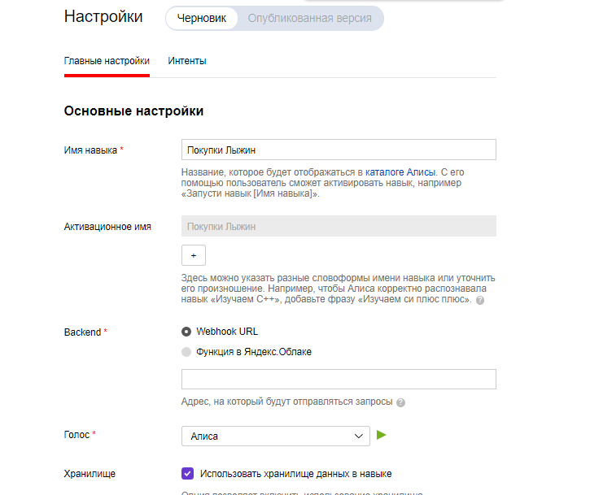
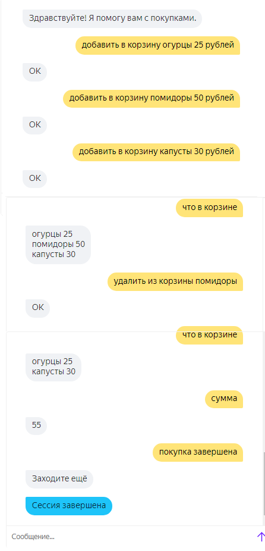
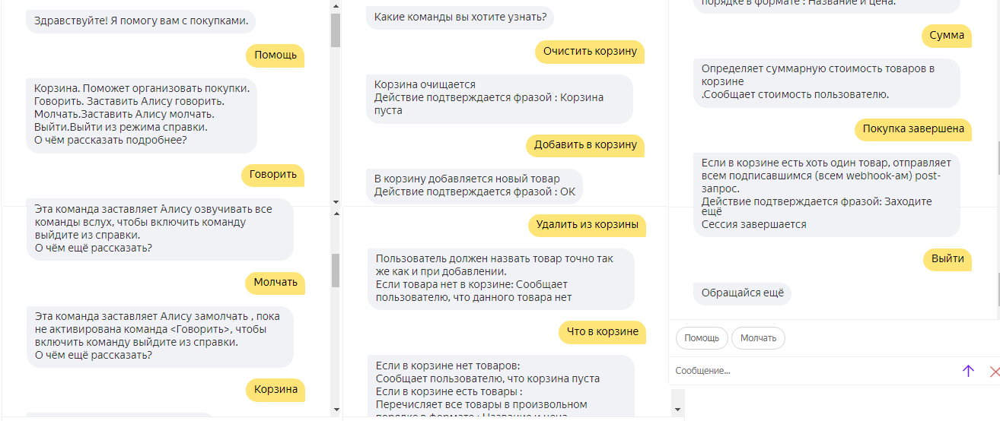

<p align="center">МИНИСТЕРСТВО НАУКИ  И ВЫСШЕГО ОБРАЗОВАНИЯ РОССИЙСКОЙ ФЕДЕРАЦИИ<br>
Федеральное государственное автономное образовательное учреждение высшего образования<br>
"КРЫМСКИЙ ФЕДЕРАЛЬНЫЙ УНИВЕРСИТЕТ им. В. И. ВЕРНАДСКОГО"<br>
ФИЗИКО-ТЕХНИЧЕСКИЙ ИНСТИТУТ<br>
Кафедра компьютерной инженерии и моделирования</p>
<br>
<h3 align="center">Отчёт по лабораторной работе № 2<br> по дисциплине "Программирование"</h3>
<br><br>
<p>студента 1 курса группы ПИ-б-о-202(2)<br>
Лыжин Игорь Дмитриевич<br>
направления подготовки 09.03.04 "Программная инженерия"</p>
<br><br>
<table>
<tr><td>Научный руководитель<br> старший преподаватель кафедры<br> компьютерной инженерии и моделирования</td>
<td>(оценка)</td>
<td>Чабанов В.В.</td>
</tr>
</table>
<br><br>
<p align="center">Симферополь, 2020</p>
<hr>

## Цель:
1.  Получить представления о структуре post-запроса;
2.  Изучить webhooks как метод взаимодействия web-приложений;

## Постановка задачи

1.  Разработайте и зарегистрируйте навык для Алисы на сервисе Яндекс Диалоги;
    
2.  В качестве backend-a для навыка реализуйте приложение на языке С++ выполняющее следующие функции:
    
    1.  Составление продуктовой корзины:
        
        -   Добавление продукта в корзину;
        -   Удаление продукта из корзины;
        -   Очистка корзины;
        -   Вывод списка товаров в корзине;
        -   Подсчёт стоимости товаров в корзине.
    2.  Вывод справочной информации по навыку;
        
    3.  Регистрацию webhook-ов сторонних сервисов;
        
    4.  Отправку данных на сторонние сервисы.
        
3.  В качестве стороннего сервиса реализуйте приложение на языке Python выполняющее следующие функции:
    
    1.  Ожидание данных о покупке;
    2.  Сохранение поступивших данных в excel-документ.

## Выполнение работы
1. Сначала я   зашёл на Яндексе  под своей почтой. Перешёл на сервис Яндекс.Диалоги: [https://dialogs.yandex.ru/](https://dialogs.yandex.ru/) . На главной странице нажал на кнопку  **_Создать навык_**, после чего попал на _dashboard, где должны находиться все созданные на этом аккаунте навыки. Далее я нажал на кнопку **_Создать диалог_**, а затем **_Навык в Алисе_**  вследствие чего попал на окно настроек навыка.

<center> <i> Рисунок 1.1. Демонстрация окна настроек навыка. </center>
 
 2. Прочитав   [документацию](https://yandex.ru/dev/dialogs/alice/doc/publish.html/#general__field-request-examples) я сделал функционал корзины, пример работы которой показан на следующем рисунке.


<center> <i> Рисунок 1.2. Демонстрация работы функционала Корзина. </center>

3. Далее была добавлена Помощь, которая отвечала за объяснения той или иной команды в навыке, функционал и работа этой команды показана на рисунке.


<center> <i> Рисунок 1.3. Демонстрация работы функционала Помощь. </center>

4. Для взаимодействия  с подчинёнными сервисами будем использовать  Webhook-и. Для этого понадобится способ их регистрации и удаления во время работы сервера. Поэтому был сделан html-шаблон, отвечающий за добавление и удаление Webhook-ов, для их массовой рассылки. Функционал показан  на скриншоте.


<center> <i> Рисунок 1.4. Демонстрация страницы управления webhook-ами с добавленным webhook-ом клиентского приложения. </center>

5. Полученные данные с навыка отправляются на клиентское приложение, предназначенное для получения данных от сервера и сохранения их в [excel-документ](./Excel-file/book.xlsx) (пример заполненной таблицы). Язык клиентского приложения: Python. 

6. Полный исходный код серверного приложения:

```c++
#include <fstream>
#include <iostream>
#include <cpp_httplib/httplib.h>
#include <string>
#include <nlohmann/json.hpp>
#include <iomanip>
using json = nlohmann::json;
using namespace httplib;

void gen_webhook(const Request& req, Response& res) {
    std::string str;
    std::ifstream l("index.html");
    std::getline(l, str, '\0');
    res.set_content(str, "text/html");
}

void posn_webhook(const Request& req, Response& res) {
    
    std::string webstring = R"(
<div class="form-row align-items-center">
    <div class="col">
      <input type="text" value="{Webhook URL}" class="form-control mb-2" disabled>
    </div>
 
    <div class="col">
        <button type="submit" name="del" value="{Webhook URL}" class="btn btn-danger mb-2">Удалить</button>
    </div>
</div> 
<!-{webhooks_list}->)";
    std::string webhooks = R"({Webhook URL})";
    std::string webcomment = R"(<!-{webhooks_list}->)";
    
    std::ifstream dl("config.json");
    
    if (!dl.is_open()) {
        json j;
        j["webhooks"] = json::array();
        std::ofstream dl("config.json");
        dl << std::setw(4) << j << std::endl;
    }
    
    

    std::string str;
    std::ifstream l("index.html");
    std::getline(l, str, '\0');
    
    if (req.has_param("set")) {
        
        std::string val = req.get_param_value("set");
        
        json j;
        std::ifstream dl("config.json");
        dl>>j;
        j["webhooks"].push_back(val);
        std::ofstream o("config.json");
        o << std::setw(4) << j << std::endl;
        
        
        str.replace(str.find(webcomment), webcomment.size(), webstring);
        while (str.find(webhooks) != std::string::npos)
        str.replace(str.find(webhooks), webhooks.size(), val);
        std::ofstream od("index.html");
        od << std::setw(4) << str << std::endl;
    }
    if (req.has_param("del")) {
        
        std::string val = req.get_param_value("del");
        
        json j;
        std :: ifstream dl("config.json");
        dl >> j;
        for (int i = 0; i < j["webhooks"].size(); i++) {
            if (j["webhooks"][i].get<std::string>() == val) {
                j["webhooks"].erase(j["webhooks"].begin() + i);
            }
        }
        std::ofstream o("config.json");
        o << std::setw(4) << j << std::endl;
       
        std::string empty = "";
        std::string webstringdel = R"(
<div class="form-row align-items-center">
    <div class="col">
      <input type="text" value="{Webhook URL}" class="form-control mb-2" disabled>
    </div>
 
    <div class="col">
        <button type="submit" name="del" value="{Webhook URL}" class="btn btn-danger mb-2">Удалить</button>
    </div>
</div> 
)";
       
        while (webstringdel.find(webhooks) != std::string::npos)
            webstringdel.replace(webstringdel.find(webhooks), webhooks.size(), val);
        str.replace(str.find(webstringdel), webstringdel.size(), empty );
       
        std::ofstream od("index.html");
        od << std::setw(4) << str << std::endl;
    }
    
}

void gen_response(const Request& req, Response& res) {
    json j;
    json jxon;
    j = json::parse(req.body.c_str());
    if (j["request"]["original_utterance"].get<std::string>() != "ping" && j["request"]["original_utterance"].get<std::string>() != "пинг") {
        if (true) {
            j["state"]["session"].push_back({ "name","null" });
            j["state"]["session"].push_back({ "thelp","null" });
            j["state"]["session"].push_back({ "value",0 });
        }
        if ((j["state"]["session"]["name"].get<std::string>() == "null") || (j["state"]["session"]["name"].get<std::string>() == "menu") && (j["request"]["command"].get<std::string>() != "помощь")) {
            std::ifstream l("response.json");
            jxon = json::parse(l);
        }
        if ((j["request"]["command"].get<std::string>() == "помощь" || j["state"]["session"]["name"].get<std::string>() == "help") && j["state"]["session"]["thelp"].get<std::string>() != "bin" ) {
            std::ifstream l1("response1.json");
            jxon = json::parse(l1);
        }
        if (j["state"]["session"]["thelp"].get<std::string>() == "bin" ) {
            std::ifstream l2("trashb.json");
            jxon = json::parse(l2);
        }
        if (j["session"]["new"].get<bool>()) {
            jxon["session_state"].push_back({ "name","menu" });
            res.set_content(jxon.dump(4), "text/json; charset=UTF-8");
        }
        else if ((j["request"]["command"].get<std::string>() != "добавить" && j["request"]["nlu"]["tokens"][0].get<std::string>() == "добавить" && j["request"]["nlu"]["tokens"][2].get<std::string>() == "корзину")&& j["state"]["session"]["thelp"].get<std::string>() != "bin") {
            jxon["session_state"].push_back({ "name","menu" });
            std::ifstream o_("buy.json");
            json rev = json::parse(o_);
            rev["check"].push_back( { {"item",j["request"]["nlu"]["tokens"][3] },{"price",j["request"]["nlu"]["tokens"][4]}} );
            std::ofstream o_1("buy.json");
            o_1 << std::setw(4) << rev << std::endl;
            jxon["response"]["text"] = "ОК";
            jxon["response"]["tts"] = "ОК";
            if (j["state"]["session"]["value"].get<int>() == 5) {
                jxon["response"]["buttons"][1]["title"] = "Говорить";
                jxon["response"].erase("tts");
                jxon["session_state"].push_back({ "value",5 });
            }
            else {
                jxon["session_state"].push_back({ "value",10 });
            }
            res.set_content(jxon.dump(4), "text/json; charset=UTF-8");
        }
        else if (j["request"]["command"].get<std::string>() != "удалить" &&j["request"]["nlu"]["tokens"][0].get<std::string>() == "удалить" && j["request"]["nlu"]["tokens"][2].get<std::string>() == "корзины" && j["state"]["session"]["thelp"].get<std::string>() != "bin" && j["state"]["session"]["name"].get<std::string>() != "help") {
            jxon["session_state"].push_back({ "name","menu" });
            int c = 0;
            std::ifstream o_("buy.json");
            json rev = json::parse(o_);
            for (int i = 0;i< rev["check"].size() ; i++) {
                if (rev["check"][i]["item"].get<std::string>() == j["request"]["nlu"]["tokens"][3].get<std::string>()) {
                    rev["check"].erase(rev["check"].begin() + i);
                    c = 1;
                }
            }
            std::ofstream o_1("buy.json");
            o_1 << std::setw(4) << rev << std::endl;
            if (c == 1) {
                jxon["response"]["text"] = "ОК";
                jxon["response"]["tts"] = "ОК";
            }
            else {
                jxon["response"]["text"] = "Данного товара нет";
                jxon["response"]["tts"] = "Данного товара нет";
            }
            if (j["state"]["session"]["value"].get<int>() == 5) {
                jxon["response"]["buttons"][1]["title"] = "Говорить";
                jxon["response"].erase("tts");
                jxon["session_state"].push_back({ "value",5 });
            }
            else {
                jxon["session_state"].push_back({ "value",10 });
            }
            res.set_content(jxon.dump(4), "text/json; charset=UTF-8");
        }
        else if (j["request"]["command"].get<std::string>() == "что в корзине" && j["state"]["session"]["thelp"].get<std::string>() != "bin" && j["state"]["session"]["name"].get<std::string>() != "help") {
            jxon["session_state"].push_back({ "name","menu" });
            std::ifstream o_("buy.json");
            json rev = json::parse(o_);
            std::string item;
            if (rev["check"][0].contains("item")) {
                for (int i = 0; i < rev["check"].size(); i++) {
                    item+=rev["check"][i]["item"];
                    item += " ";
                    item += rev["check"][i]["price"];
                    item += "\n";

                }
                jxon["response"]["text"] = item;
                jxon["response"]["tts"] = item;
            }
            else {
                jxon["response"]["text"] = "Корзина пуста.";
                jxon["response"]["tts"] = "Корзина пуста.";
            }
            if (j["state"]["session"]["value"].get<int>() == 5) {
                jxon["response"]["buttons"][1]["title"] = "Говорить";
                jxon["response"].erase("tts");
                jxon["session_state"].push_back({ "value",5 });
            }
            else {
                jxon["session_state"].push_back({ "value",10 });
            }
            res.set_content(jxon.dump(4), "text/json; charset=UTF-8");
        }
        else if (j["request"]["command"].get<std::string>() == "очистить корзину" && j["state"]["session"]["thelp"].get<std::string>() != "bin" && j["state"]["session"]["name"].get<std::string>() != "help") {
            jxon["session_state"].push_back({ "name","menu" });
            std::ifstream o_("buy.json");
            json rev = json::parse(o_);

            for (int i=0;i<rev["check"].size();){
                rev["check"].erase(rev["check"].begin() + i);
            }
            
            std::ofstream o_1("buy.json");
            o_1 << std::setw(4) << rev << std::endl;
            jxon["response"]["text"] = "Корзина пуста.";
            jxon["response"]["tts"] = "Корзина пуста.";
            if (j["state"]["session"]["value"].get<int>() == 5) {
                jxon["response"]["buttons"][1]["title"] = "Говорить";
                jxon["response"].erase("tts");
                jxon["session_state"].push_back({ "value",5 });
            }
            else {
                jxon["session_state"].push_back({ "value",10 });
            }
            res.set_content(jxon.dump(4), "text/json; charset=UTF-8");
        }
        else if (j["request"]["command"].get<std::string>() == "сумма" && j["state"]["session"]["thelp"].get<std::string>() != "bin" && j["state"]["session"]["name"].get<std::string>() != "help") {
        jxon["session_state"].push_back({ "name","menu" });
        std::ifstream o_("buy.json");
        json rev = json::parse(o_);
        int sum = 0; 
        if (rev["check"][0].contains("price")) {
            for (int i = 0; i < rev["check"].size(); i++) {
                sum = sum + std::stoi(rev["check"][i]["price"].get<std::string>());
            }
        }
        jxon["response"]["text"] = sum;
        jxon["response"]["tts"] = sum;
        if (j["state"]["session"]["value"].get<int>() == 5) {
            jxon["response"]["buttons"][1]["title"] = "Говорить";
            jxon["response"].erase("tts");
            jxon["session_state"].push_back({ "value",5 });
        }
        else {
            jxon["session_state"].push_back({ "value",10 });
        }
        res.set_content(jxon.dump(4), "text/json; charset=UTF-8");
        }
        else if (j["request"]["command"].get<std::string>() == "покупка завершена" && j["state"]["session"]["thelp"].get<std::string>() != "bin" && j["state"]["session"]["name"].get<std::string>() != "help") {
        std::ifstream o_("buy.json");
        json rev = json::parse(o_);
        if (rev["check"][0].contains("item")) {
            if (j["session"]["user"].contains("user_id")) {
                rev["user_id"] = j["session"]["user"]["user_id"];
            }
            else {
                rev["user_id"] = "anonymous";
            }

            std::ifstream l("config.json");

           if (l.is_open()) {
                std::string str, str2;
                json j = json::parse(l);
                std::string mayk = "http://";
                for (int i = 0; i < j["webhooks"].size(); i++) {
                    str =j["webhooks"][i];
                    int dil = str.find('/', mayk.size());
                    str2 = str.substr(0, dil);
                    Client cli(str2.c_str());
                    str2= str.substr(dil, -1);
                    cli.Post(str2.c_str(), rev.dump(4), "application/json");
                }
           }

     
        }
        jxon["response"]["text"] = "Заходите ещё";
        jxon["response"]["tts"] = "Заходите ещё";
        jxon["response"]["end_session"] = true;
        if (j["state"]["session"]["value"].get<int>() == 5) {
            jxon["response"].erase("tts");
        }
        res.set_content(jxon.dump(4), "text/json; charset=UTF-8");
        }
        else if ((j["request"]["command"].get<std::string>() == "молчать") && (j["state"]["session"]["name"].get<std::string>() == "menu")) {
            jxon["response"].erase("tts");
            jxon["session_state"].push_back({ "value",5 });
            jxon["session_state"].push_back({ "name","menu" });
            jxon["response"]["text"] = "Молчу, молчу";
            jxon["response"]["buttons"][1]["title"] = "Говорить";
            res.set_content(jxon.dump(4), "text/json; charset=UTF-8");
        }
        else if ((j["request"]["command"].get<std::string>() == "говорить") && (j["state"]["session"]["name"].get<std::string>() == "menu")) {
            jxon["session_state"].push_back({ "value",10 });
            jxon["session_state"].push_back({ "name","menu" });
            jxon["response"]["text"] = "Хорошо";
            jxon["response"]["tts"] = "Хорошо";
            jxon["response"]["buttons"][1]["title"] = "Молчать";
            res.set_content(jxon.dump(4), "text/json; charset=UTF-8");
        }
        else if (j["request"]["command"].get<std::string>() == "помощь" || j["state"]["session"]["name"].get<std::string>() == "help") {
            int c = 0;
            jxon["session_state"].push_back({ "name","help" });
            if (j["request"]["command"].get<std::string>() == "говорить" && j["state"]["session"]["thelp"] != "bin") {
                jxon["response"]["text"] = "Эта команда заставляет Алису озвучивать все команды вслух, чтобы включить команду выйдите из справки.\nО чём ещё рассказать?";
                jxon["response"]["tts"] = "Эта команда заставляет Алису озвучивать все команды вслух, сейчас эта команда работает. О чём ещё рассказать?";
                c = 1;
            }
            if (j["request"]["command"].get<std::string>() == "молчать" && j["state"]["session"]["thelp"]!="bin") {
                jxon["response"]["text"] = "Эта команда заставляет Алису замолчать , пока не активирована команда <Говорить>, чтобы включить команду выйдите из справки.\nО чём ещё рассказать?";
                jxon["response"]["tts"] = "Эта команда заставляет Алису замолчать , пока не активирована команда Говорить, чтобы включить команду выйдите из справки. О чём ещё рассказать?";
                c = 1;
            }
            if (j["request"]["command"].get<std::string>() == "корзина" && j["state"]["session"]["thelp"] != "bin") {
                std::ifstream l2("trashb.json");
                jxon = json::parse(l2);
                jxon["session_state"].push_back({ "thelp","bin" });
                jxon["session_state"].push_back({ "name","help" });
                c = 1;
            }
            if (j["state"]["session"]["thelp"].get<std::string>() == "bin") {
                jxon["session_state"].push_back({ "thelp","bin" });
                if (j["request"]["command"].get<std::string>() == "очистить корзину") {
                    jxon["response"]["text"] = "Корзина очищается\nДействие подтверждается фразой : Корзина пуста ";
                    jxon["response"]["tts"] = "Корзина очищается. Действие подтверждается фразой. Корзина пуста ";
                    c = 1;
                }
                if (j["request"]["command"].get<std::string>() == "добавить в корзину") {
                    jxon["response"]["text"] = "В корзину добавляется новый товар\n Действие подтверждается фразой : ОК ";
                    jxon["response"]["tts"] = "Я добавляю в корзину  новый товар. Ваше действие подтверждается фразой.  ОК";
                    c = 1;
                }
                if (j["request"]["command"].get<std::string>() == "удалить из корзины") {
                    jxon["response"]["text"] = "Пользователь должен назвать товар точно так же как и при добавлении. \n Если товара нет в корзине: Сообщает пользователю, что данного товара нет ";
                    jxon["response"]["tts"] = "Пользователь должен назвать товар точно так же как и при добавлении. Если товара нет в корзине, то я сообщаю пользователю, что данного товара нет ";
                    c = 1;
                }
                if (j["request"]["command"].get<std::string>() == "что в корзине") {
                    jxon["response"]["text"] = "Если в корзине нет товаров:\n Сообщает пользователю, что корзина пуста \nЕсли в корзине есть товары :\nПеречисляет все товары в произвольном порядке в формате : Название и цена.";
                    jxon["response"]["tts"] = "Если в корзине нет товаров. Сообщает пользователю, что корзина пуста. Если в корзине есть товары. Перечисляет все товары в произвольном порядке в формате. Название и цена.";
                    c = 1;
                }
                if (j["request"]["command"].get<std::string>() == "сумма") {
                    jxon["response"]["text"] = "Определяет суммарную стоимость товаров в корзине\n.Сообщает стоимость пользователю.";
                    jxon["response"]["tts"] = "Данная команда определяет суммарную стоимость товаров в корзине. Я сообщаю стоимость пользователю.";
                    c = 1;
                }
                if (j["request"]["command"].get<std::string>() == "покупка завершена") {
                    jxon["response"]["text"] = "Если в корзине есть хоть один товар, отправляет всем подписавшимся (всем webhook-ам) post-запрос. \n Действие подтверждается фразой: Заходите ещё \n Сессия завершается";
                    jxon["response"]["tts"] = "Если в корзине есть хоть один товар, отправляю всем подписавшимся (всем webhook-ам) post-запрос. \n Действие подтверждаю фразой: Заходите ещё \n Сессия завершается ";
                    c = 1;
                }
            }
            if (j["request"]["command"].get<std::string>() == "выйти") {
                std::ifstream l("response.json");
                jxon = json::parse(l);
                jxon["response"]["text"] = "Обращайся ещё";
                jxon["response"]["tts"] = "Обращайся ещё";
                jxon["session_state"].push_back({ "name","menu" });
                c = 1;
            }
            if (j["state"]["session"]["value"].get<int>() == 5 ) {
                if (j["request"]["command"].get<std::string>() == "выйти") {
                    jxon["response"]["buttons"][1]["title"] = "Говорить";
                }
                jxon["response"].erase("tts");
                jxon["session_state"].push_back({ "value",5 });
            }
            else {
                jxon["session_state"].push_back({ "value",10 });
            }
            if (c == 0 && j["request"]["command"].get<std::string>() != "помощь") {
                jxon["response"]["text"] = "Неизвестная команда";
                jxon["response"]["tts"] = "Неизвестная команда";
            }
            res.set_content(jxon.dump(4), "text/json; charset=UTF-8");
        }
        else {
            jxon["response"]["text"] = "Неизвестная команда.";
            if (j["state"]["session"]["value"].get<int>() == 5) {
                jxon["response"].erase("tts");
                jxon["session_state"].push_back({ "value",5 });
            }
            else {
                if (j["state"]["session"]["name"].get<std::string>() == "menu") {
                    jxon["session_state"].push_back({ "name","menu" });
                }
                jxon["response"]["tts"] = "Неизвестная команда.";
                jxon["session_state"].push_back({ "value",10 });
            }
            if (j["state"]["session"]["name"].get<std::string>() == "menu" && j["state"]["session"]["value"].get<int>() == 5) {
                jxon["response"]["buttons"][1]["title"] = "Говорить";
                jxon["session_state"].push_back({ "name","menu" });
            }

            res.set_content(jxon.dump(4), "text/json; charset=UTF-8");
        }
    }
}


int main() {
    Server svr;         
    svr.Get("/webhooks", gen_webhook);
    svr.Post("/webhooks", posn_webhook);
    svr.Post("/", gen_response);     
    svr.listen("localhost",1234);        
}
```

7. Полный исходный код клиентского приложения:
```python
from flask import Flask, request
import openpyxl
import json
import datetime


sheet=None
boo=None
s=[]
rown=1
app = Flask(__name__)
 
@app.route('/', methods=['POST', 'GET'])
def index():
        global s,rown,sheet,boo
        if request.method == 'POST':
                check=request.get_json()
                for item in check["check"]:
                        cel = [check["user_id"],item["item"],item["price"]]
                        s.append(cel)
                if len(s)>1000:
                        try:
                                f=open("book.xlsx")
                        except FileNotFoundError:
                                        boo=openpyxl.Workbook()
                                        sheet=boo.active
                                        boo.save("book.xlsx")
                                        boo.close()
                                        f=open("book.xlsx")
                        if f:
                                boo=openpyxl.open("book.xlsx")
                                sheet=boo.active
                                if sheet.cell(row=1,column=1).value is None:
                                        sheet.cell(rown,column=1).value='N'
                                        sheet.cell(rown,column=2).value='User ID'
                                        sheet.cell(rown,column=3).value='Datetime'
                                        sheet.cell(rown,column=4).value='Item'
                                        sheet.cell(rown,column=5).value='Prise'
                                while sheet.cell(rown,column=1).value is not None:
                                        rown+=1
                                for cel in s:
                                        for it in range(1):
                                                d1=datetime.datetime.today()
                                                d1=d1.strftime("%a %d %b %X")
                                                sheet[rown][0].value=rown-1
                                                sheet[rown][1].value=cel[it]
                                                sheet[rown][2].value=d1
                                                sheet[rown][3].value=cel[it+1]
                                                sheet[rown][4].value=cel[it+2]
                                        rown+=1     
                                boo.save("book.xlsx")
                                boo.close()
                        s.clear()
                                
                        
        return 'OK'
if __name__ == "__main__":
    app.run()
```

## Вывод по работе. 
Цель работы была  достигнута. Было выполнено:
- Создание сервера на языке С++  отвечающий  за взаимодействие с Алисой, а так же за обработку и дальнейшую пересылку данных подчинённым сервисам  и отправки  html страницы с последующим созданием запроса в формате json
- Создание клиентского приложения на языке Python, получающее и обрабатывающее данные из сервера в excel-таблицу.