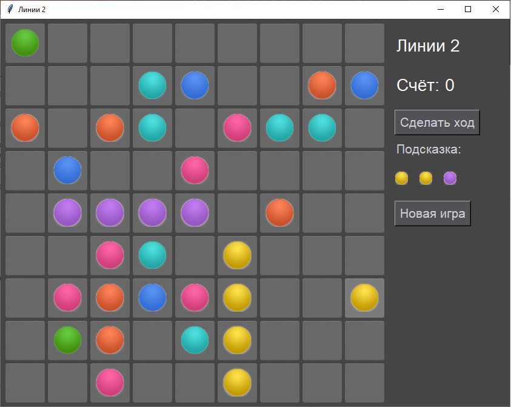

<p align="center">МИНИСТЕРСТВО НАУКИ  И ВЫСШЕГО ОБРАЗОВАНИЯ РОССИЙСКОЙ ФЕДЕРАЦИИ<br>
Федеральное государственное автономное образовательное учреждение высшего образования<br>
"КРЫМСКИЙ ФЕДЕРАЛЬНЫЙ УНИВЕРСИТЕТ им. В. И. ВЕРНАДСКОГО"<br>
ФИЗИКО-ТЕХНИЧЕСКИЙ ИНСТИТУТ<br>
Кафедра компьютерной инженерии и моделирования</p>
<br>
<h3 align="center">Отчёт по лабораторной работе № 3<br> по дисциплине "Программирование"</h3>
<br><br>
<p>студента 1 курса группы ПИ-б-о-202(2)<br>
Лыжин Игорь Дмитриевич<br>
направления подготовки 09.03.04 "Программная инженерия"</p>
<br><br>
<table>
<tr><td>Научный руководитель<br> старший преподаватель кафедры<br> компьютерной инженерии и моделирования</td>
<td>(оценка)</td>
<td>Чабанов В.В.</td>
</tr>
</table>
<br><br>
<p align="center">Симферополь, 2020</p>
<hr>

## Цель:
1.   Закрепить навыки разработки программ с простым графическим интерфейсом пользователя на зыке Python при помощи библиотеки Tkinter.
2.   Получить представление о разработке простых игровых приложений.

## Постановка задачи

1.  Используя стандартный модуль для разработки программ с графическим интерфейсом Tkinter реализуйте игру Lines на зыке Python.
2.  В качестве образца графического интерфейса используйте [данную игру](http://game-shariki.ru/linii-2).


## Выполнение работы

Игровое поле было сделано при помощи текстовой метки Label и взаимодействие с ним осуществлялось с помощью параметров, которые принимал Label и передача их в двухмерный/одномерный массив для последующего изменения этих параметров.

Потом были  добавлены кнопки и текст для отображения состояния игры:
1. Кнопка "Новая игра"  обнуляет игровое поля и переводит игру в изначальное состояние, чтобы  продолжать  взаимодействовать  с игровым полем не выходя из программы.
2. Кнопка "Сделать ход" добавляет на игровое поле 3 шара.
3.  Текст "Подсказка" показывает 3 шара которые будут добавлены на игровое поле в случае нажатии на кнопку "Сделать ход" или при перемещении шара, если при этом не произойдёт удаление шаров.
4. Текст "Игра окончена!" появляется в случае заполнения всех пустых клеток на игровом поле, надпись убирается в случае нажатия на кнопку "Новая игра"
5. Текст "Счёт: (число) " показывает текущий счёт, который меняется в случае удаления шаров на игровом поле, за каждый удалённый шар добавляется 2 очка. Обнуление счёта происходит при нажатии кнопки "Новая игра".

После каждого перетаскивания шарика на игровое поле происходит проверка поиска пути, которая ищет при помощи рекурсии точку нажатия, если путь к этой точке недоступен, то ничего не произойдёт. Если же путь был найдёт то шарик становится на место точки нажатия и происходит проверка на наличие 5 шариков по горизонтали, вертикали и диагонали.

<i> Скриншоты показывающие  работу программы:</i> 

<center> <i> Рисунок 1.1. Демонстрация окна  программы. </i> </center>

 


<center> <i> Рисунок 1.2-1.3. Демонстрация работы удаление шаров с игрового поля и изменение счёта.</i> </center>


<center> <i> Рисунок 1.4. Демонстрация завершения игры.</i> </center>

Полный исходный код Python приложения:
   
   ```python
from tkinter import *
import tkinter as tk
from PIL import ImageTk, Image
from random import randint,shuffle,choice

def finallly_g_o():
    for i in range(N):
        for j in range(N):
            if bord[i][j]['text']==nums:
                return False
    
    ticktick.place(x=635,y=400)
    return True

def game_over():
    global score
    for row in range(N):
        for col in range(N):
            bord[row][col].config(image=tileempty)
            bord[row][col]['text']=nums
            bord[row][col]['textvariable']=zero
            bord[row][col]['underline']=nums
            score=0
            scorelbl.config(text=score)
            hint1.config(image=f451empty)
            hint2.config(image=f451empty)
            hint3.config(image=f451empty)
countdown=1
schet=1
wrongs=0
wrong=0
def updown(row,col):
        global countdown,score,schet,wrongs,wrong
        pup=0
        if col-countdown>=0:
            if bord[row][col]['text']==bord[row][col-countdown]['text'] and wrong==0:
                pup=1
                if bord[row][col-countdown]['textvariable']!=2:
                    bord[row][col-countdown]['textvariable']=3
                else:
                    bord[row][col-countdown]['underline']=3
                    bord[row][col-countdown]['textvariable']=3
                schet=schet+1
            if pup!=1:
                wrong=1
        if col+countdown<N:
            if bord[row][col]['text']==bord[row][col+countdown]['text'] and wrongs==0:
                if bord[row][col+countdown]['textvariable']!=2:
                    bord[row][col+countdown]['textvariable']=3
                else:
                    bord[row][col+countdown]['underline']=3
                    bord[row][col+countdown]['textvariable']=3
                schet=schet+1
                pup=2
            if pup!=2:
                wrongs=1
        if pup!=0:
            countdown=countdown+1
        if schet==5:
            wrong=0
            wrongs=0
            score=score+10
            scorelbl.config(text=score)
            for i in range (N):
                for j in range (N):
                    if bord[i][j]['textvariable']==3 and bord[i][j]['underline']!=3:
                        bord[i][j]['textvariable']=zero
                        bord[i][j]['underline']=nums
                        bord[i][j]['text']=nums
                        bord[i][j].config(image=tileempty)
                    if bord[i][j]['underline']==3 and bord[i][j]['textvariable']==3:
                        bord[i][j]['text']=nums
                        bord[i][j]['textvariable']=2
                        bord[i][j].config(image=tileempty)
            
            bord[row][col].config(image=tileempty)
            schet=1
            countdown=1
            return True
        if pup==0:
            wrong=0
            wrongs=0
            schet=1
            countdown=1
            return False
        return(updown(row,col))

def leftright(row,col):
        global countdown,score,schet,wrongs,wrong
        pup=0
        if row-countdown>=0:
            if bord[row][col]['text']==bord[row-countdown][col]['text'] and wrong==0:
                pup=1
                if bord[row-countdown][col]['textvariable']!=2:
                    bord[row-countdown][col]['textvariable']=3
                else:
                    bord[row-countdown][col]['underline']=3
                    bord[row-countdown][col]['textvariable']=3
                schet=schet+1
            if pup!=1:
                wrong=1
        if row+countdown<N:
            if bord[row][col]['text']==bord[row+countdown][col]['text'] and wrongs==0:
                if bord[row+countdown][col]['textvariable']!=2:
                    bord[row+countdown][col]['textvariable']=3
                else:
                    bord[row+countdown][col]['underline']=3
                    bord[row+countdown][col]['textvariable']=3
                schet=schet+1
                pup=2
            if pup!=2:
                wrongs=1
        if pup!=0:
            countdown=countdown+1
        if schet==5:
            wrong=0
            wrongs=0
            score=score+10
            scorelbl.config(text=score)
            for i in range (N):
                for j in range (N):
                    if bord[i][j]['textvariable']==3 and bord[i][j]['underline']!=3:
                        bord[i][j]['textvariable']=zero
                        bord[i][j]['underline']=nums
                        bord[i][j]['text']=nums
                        bord[i][j].config(image=tileempty)
                    if bord[i][j]['underline']==3 and bord[i][j]['textvariable']==3:
                        bord[i][j]['text']=nums
                        bord[i][j]['textvariable']=2
                        bord[i][j].config(image=tileempty)
            
            bord[row][col].config(image=tileempty)
            schet=1
            countdown=1
            return True
        if pup==0:
            wrong=0
            wrongs=0
            schet=1
            countdown=1
            return False
        return(leftright(row,col))
def diagonaleleft(row,col):
        global countdown,score,schet,wrongs,wrong
        pup=0
        if row-countdown>=0 and col-countdown>=0:
            if bord[row][col]['text']==bord[row-countdown][col-countdown]['text'] and wrong==0:
                pup=1
                if bord[row-countdown][col-countdown]['textvariable']!=2:
                    bord[row-countdown][col-countdown]['textvariable']=3
                else:
                    bord[row-countdown][col-countdown]['underline']=3
                    bord[row-countdown][col-countdown]['textvariable']=3
                schet=schet+1
            if pup!=1:
                wrong=1
        if row+countdown<N and col+countdown<N:
            if bord[row][col]['text']==bord[row+countdown][col+countdown]['text'] and wrongs==0:
                if bord[row+countdown][col+countdown]['textvariable']!=2:
                    bord[row+countdown][col+countdown]['textvariable']=3
                else:
                    bord[row+countdown][col+countdown]['underline']=3
                    bord[row+countdown][col+countdown]['textvariable']=3
                schet=schet+1
                pup=2
            if pup!=2:
                wrongs=1
        if pup!=0:
            countdown=countdown+1
        if schet==5:
            wrong=0
            wrongs=0
            score=score+10
            scorelbl.config(text=score)
            for i in range (N):
                for j in range (N):
                    if bord[i][j]['textvariable']==3 and bord[i][j]['underline']!=3:
                        bord[i][j]['textvariable']=zero
                        bord[i][j]['underline']=nums
                        bord[i][j]['text']=nums
                        bord[i][j].config(image=tileempty)
                    if bord[i][j]['underline']==3 and bord[i][j]['textvariable']==3:
                        bord[i][j]['text']=nums
                        bord[i][j]['textvariable']=2
                        bord[i][j].config(image=tileempty)
            
            bord[row][col].config(image=tileempty)
            schet=1
            countdown=1
            return True
        if pup==0:
            wrong=0
            wrongs=0
            schet=1
            countdown=1
            return False
        return(diagonaleleft(row,col))
def diagonaleright(row,col):
        global countdown,score,schet,wrongs,wrong
        pup=0
        if row+countdown<N and col-countdown<N:
            if bord[row][col]['text']==bord[row+countdown][col-countdown]['text'] and wrong==0:
                pup=1
                if bord[row+countdown][col-countdown]['textvariable']!=2:
                    bord[row+countdown][col-countdown]['textvariable']=3
                else:
                    bord[row+countdown][col-countdown]['underline']=3
                    bord[row+countdown][col-countdown]['textvariable']=3
                schet=schet+1
            if pup!=1:
                wrong=1
        if row-countdown<N and col+countdown<N:
            if bord[row][col]['text']==bord[row-countdown][col+countdown]['text'] and wrongs==0:
                if bord[row-countdown][col+countdown]['textvariable']!=2:
                    bord[row-countdown][col+countdown]['textvariable']=3
                else:
                    bord[row-countdown][col+countdown]['underline']=3
                    bord[row-countdown][col+countdown]['textvariable']=3
                schet=schet+1
                pup=2
            if pup!=2:
                wrongs=1
        if pup!=0:
            countdown=countdown+1
        if schet==5:
            wrong=0
            wrongs=0
            score=score+10
            scorelbl.config(text=score)
            for i in range (N):
                for j in range (N):
                    if bord[i][j]['textvariable']==3 and bord[i][j]['underline']!=3:
                        bord[i][j]['textvariable']=zero
                        bord[i][j]['underline']=nums
                        bord[i][j]['text']=nums
                        bord[i][j].config(image=tileempty)
                    if bord[i][j]['underline']==3 and bord[i][j]['textvariable']==3:
                        bord[i][j]['text']=nums
                        bord[i][j]['textvariable']=2
                        bord[i][j].config(image=tileempty)
            
            bord[row][col].config(image=tileempty)
            schet=1
            countdown=1
            return True
        if pup==0:
            wrong=0
            wrongs=0
            schet=1
            countdown=1
            return False
        return(diagonaleright(row,col))
def clearingTrue():
    for i in range (N):
        for j in range (N):
            if bord[i][j]['underline']==3:
                bord[i][j]['underline']=nums
            if bord[i][j]['textvariable']==3:
                bord[i][j]['textvariable']=zero
def clearingFalse():
    for i in range (N):
        for j in range (N):
            if bord[i][j]['underline']==3:
                bord[i][j]['underline']=wall
            if bord[i][j]['textvariable']==3:
                bord[i][j]['textvariable']=zero
    return
def legendaryproverka():
    nick=0
    for b in range (N):
        for o in range(N):
            if bord[b][o]['textvariable']==2:
                if updown(b,o):
                    nick=1
                    clearingTrue()
                if leftright(b,o):
                    nick=1
                    clearingTrue()
                if diagonaleleft(b,o):
                    nick=1
                    clearingTrue()
                if diagonaleright(b,o):
                    nick=1
                    clearingTrue()
                clearingFalse()

    if nick==1:
        for i in range(N):
            for j in range(N):
                if bord[i][j]['textvariable']==2 and bord[i][j]['text']==nums:
                    bord[i][j]['underline']=nums
                    bord[i][j]['textvariable']=zero
                if bord[i][j]['textvariable']==2:
                    bord[i][j]['text']=nums
                    bord[i][j]['underline']=nums
                    bord[i][j]['textvariable']=zero
        return True
    else:
        for i in range(N):
            for j in range (N):
                if bord[i][j]['textvariable']==2:
                    bord[i][j]['textvariable']=zero
        return False
bll=[]
bigbuffer=[]
def random():
    global bll,bigbuffer
    buffer=list(range(0,80)) 
    shuffle(buffer)
    for i in range (3):
        bll.append(randint(0,6))
        bigbuffer.append(buffer[i])
    hint1.config(image=colours3[bll[0]])
    hint2.config(image=colours3[bll[1]])
    hint3.config(image=colours3[bll[2]])
    
def supos_generator():
    global bll,bigbuffer
    dangerous=[]
    miss=0
    saved=0
    save=[-1]  
    for l in range (3):
        for i in range (N*N):
            if i==bigbuffer[l] and line[i]['text']==nums:
                line[i]['text']=bll[l]
                line[i]['underline']=wall
                line[i]['textvariable']=2
                line[i].config(image=colours[int(bll[l])])
            elif i==bigbuffer[l]:
                save.append(bll[l])
                miss=miss+1
    for i in range (0,N*N):
        if int(line[i]['text'])==nums:
            dangerous.append(i)
    for i in range (3):
        if miss!=0:
            saved=choice(dangerous)
            line[saved]['text']=save[miss]
            line[saved]['underline']=wall
            line[saved]['textvariable']=2
            line[saved].config(image=colours[int(save[miss])])
            miss=miss-1
    bll=[]
    bigbuffer=[]
    legendaryproverka()
    finallly_g_o()

def click_button_2():
    ticktick.place(x=900,y=400)
    game_over()
    supos_generator()
    random()
def click_button_3():
    if finallly_g_o():
        pass
    else:
        supos_generator()
        random()
        

check=1
candis=2
predict=0
depth=[]
def set_img2(event):
    global candis,predict,depth,check
    click=zero
    i=zero
    j=zero
    tile=event.widget
    for row in range(N):
        for col in range(N):
            if bord[row][col]['textvariable']==1:
                bord[row][col]['textvariable']=zero
                bord[row][col]['underline']=candis
                bord[row][col].config(image=colours[int(bord[row][col]['text'])])
                i=row
                j=col
                click=click+1
    if int(tile['text'])>nums:
        depth=[]
        tile.config(image=colours2[int(tile['text'])])
        tile['textvariable']=1
        for row in range(N):
            for col in range(N):
                if bord[row][col]['underline']==candis:
                    bord[row][col]['underline']=wall
                if bord[row][col]['underline']==zero:
                    bord[row][col]['underline']=nums
    if int(tile['text'])==nums and click!=zero and path(tile.row,tile.col,predict):
        depth=[]
        for row in range(N):
            for col in range(N):
                if bord[row][col]['underline']==candis:
                    bord[row][col]['underline']=nums
                if bord[row][col]['underline']==zero:
                    bord[row][col]['underline']=nums
        predict=0
        tile.config(image=colours[int(bord[i][j]['text'])])
        tile['text']=bord[i][j]['text']
        tile['textvariable']=2
        tile['underline']=3
        bord[i][j]['text']=nums
        bord[i][j].config(image=tileempty)
        if legendaryproverka():
            pass
        else:
            supos_generator()
            random()
        finallly_g_o()

        

def path(row,col,predict):
    global depth
    win=0
    bord[row][col]['underline']=zero
    if row-1>=0:
        if bord[row-1][col]['underline']==candis:
               win=1 
        if col-1>=0:
            if bord[row][col-1]['underline']==candis:
               win=1
        if row+1<N:
            if bord[row+1][col]['underline']==candis:
                win=1
        if col+1<N:
            if bord[row][col+1]['underline']==candis:
                win=1
        if win or predict:
            predict=1
            return True
        if bord[row-1][col]['underline']==nums:
            depth.append(1)
            return(path(row-1,col,predict))
    if col-1>=0:
        if bord[row][col-1]['underline']==candis:
               win=1 
        if row-1>=0:
            if bord[row-1][col]['underline']==candis:
               win=1
        if row+1<N:
            if bord[row+1][col]['underline']==candis:
                win=1
        if col+1<N:
            if bord[row][col+1]['underline']==candis:
                win=1
        if win or predict:
            predict=1
            return True
        if bord[row][col-1]['underline']==nums:
            depth.append(2)
            return(path(row,col-1,predict))
    if row+1<N:
        if bord[row+1][col]['underline']==candis:
               win=1 
        if col-1>=0:
            if bord[row][col-1]['underline']==candis:
               win=1
        if row-1<N:
            if bord[row-1][col]['underline']==candis:
                win=1
        if col+1<N:
            if bord[row][col+1]['underline']==candis:
                win=1
        if win or predict:
            predict=1
            return True
        if bord[row+1][col]['underline']==nums:
            depth.append(3)
            return(path(row+1,col,predict))
    if col+1<N:
        if bord[row][col+1]['underline']==candis:
               win=1 
        if col-1>=0:
            if bord[row][col-1]['underline']==candis:
               win=1
        if row+1<N:
            if bord[row+1][col]['underline']==candis:
                win=1
        if row-1<N:
            if bord[row-1][col]['underline']==candis:
                win=1
        if win or predict:
            predict=1
            return True
        if bord[row][col+1]['underline']==nums:
            depth.append(4)
            return(path(row,col+1,predict))
    if predict:
        return True
    tilt=0
    if row-1<N:
        if bord[row-1][col]['underline']==zero :
            tilt=1
    if col-1>=0:
        if bord[row][col-1]['underline']==zero:
            tilt=1
    if row+1<N:
        if bord[row+1][col]['underline']==zero :
             tilt=1   
    if col+1<N:
        if bord[row][col+1]['underline']==zero:
             tilt=1
    if tilt:
        try:
            if depth[len(depth)-1]==1:
                del depth[len(depth)-1]
                return(path(row+1,col,predict))
        except IndexError:
            return False
        if depth[len(depth)-1]==2:
            del depth[len(depth)-1]
            return(path(row,col+1,predict))
        if depth[len(depth)-1]==3:
            del depth[len(depth)-1]
            return(path(row-1,col,predict))
        if depth[len(depth)-1]==4:
            del depth[len(depth)-1]
            return(path(row,col-1,predict))

root = Tk()
score=0
bord = []
line = []
N = 9
color=7
name=Label(root,text="Линии 2",font=("Arial,Helvetica,sans-serif",21),bg="#454545",fg="#FFFAFA")
name.place(x=650,y=25)

name2=Label(root,text="Счёт:",font=("Arial,Helvetica,sans-serif",21),bg="#454545",fg="#FFFAFA")
name2.place(x=650,y=90)

scorelbl=Label(root,text=score,font=("Arial,Helvetica,sans-serif",21),bg="#454545",fg="#FFFAFA")
scorelbl.place(x=730,y=90)
            
button = Button(root, text="Сделать ход",font=("Arial,Helvetica,sans-serif",16),bg="#515156",fg="#d1d1d9",command=click_button_3)
button.place(x=650,y=150)

name3=Label(root,text="Подсказка:",font=("Arial,Helvetica,sans-serif",16),bg="#454545",fg="#d1d1d9")
name3.place(x=650,y=200)

button_2 = Button(root, text="Новая игра",font=("Arial,Helvetica,sans-serif",16),bg="#515156",fg="#d1d1d9",command=click_button_2)
button_2.place(x=650,y=300)

ticktick=Label(root,text="Игра окончена!",font=("Arial,Helvetica,sans-serif",21),bg="#454545",fg="#FFFAFA")
ticktick.place(x=900,y=400)


root.geometry('840x639')
root.configure(bg="#454545")


root.title("Линии 2")

 
tileset = Image.open("cell-bgr.png").convert('RGBA')
tilecrop=tileset.crop((1, 0, 67, 66))
tilecrop2=tileset.crop((1, 69, 67, 135))
tileempty=ImageTk.PhotoImage(tilecrop)


greenball = Image.open("ball-green.png").convert('RGBA')
greencrop=greenball.crop((3,3,51,51))
tilecrop.paste(greencrop,(9,8),greencrop)
tilecrop2.paste(greencrop,(9,8),greencrop)
greenwall=ImageTk.PhotoImage(tilecrop)
greenwall2=ImageTk.PhotoImage(tilecrop2)

aquaball=Image.open("ball-aqua.png").convert('RGBA')
aquacrop=aquaball.crop((3,3,51,51))
tilecrop.paste(aquacrop,(9,8),aquacrop)
tilecrop2.paste(aquacrop,(9,8),aquacrop)
aquawall=ImageTk.PhotoImage(tilecrop)
aquawall2=ImageTk.PhotoImage(tilecrop2)

blueball=Image.open("ball-blue.png").convert('RGBA')
bluecrop=blueball.crop((3,3,51,51))
tilecrop.paste(bluecrop,(9,8),bluecrop)
tilecrop2.paste(bluecrop,(9,8),bluecrop)
bluewall=ImageTk.PhotoImage(tilecrop)
bluewall2=ImageTk.PhotoImage(tilecrop2)

pinkball=Image.open("ball-pink.png").convert('RGBA')
pinkcrop=pinkball.crop((3,3,51,51))
tilecrop.paste(pinkcrop,(9,8),pinkcrop)
tilecrop2.paste(pinkcrop,(9,8),pinkcrop)
pinkwall=ImageTk.PhotoImage(tilecrop)
pinkwall2=ImageTk.PhotoImage(tilecrop2)

redball=Image.open("ball-red.png").convert('RGBA')
redcrop=redball.crop((3,3,51,51))
tilecrop.paste(redcrop,(9,8),redcrop)
tilecrop2.paste(redcrop,(9,8),redcrop)
redwall=ImageTk.PhotoImage(tilecrop)
redwall2=ImageTk.PhotoImage(tilecrop2)

violetball=Image.open("ball-violet.png").convert('RGBA')
violetcrop=violetball.crop((3,3,51,51))
tilecrop.paste(violetcrop,(9,8),violetcrop)
tilecrop2.paste(violetcrop,(9,8),violetcrop)
violetwall=ImageTk.PhotoImage(tilecrop)
violetwall2=ImageTk.PhotoImage(tilecrop2)

yellowball=Image.open("ball-yellow.png").convert('RGBA')
yellowcrop=yellowball.crop((3,3,51,51))
tilecrop.paste(yellowcrop,(9,8),yellowcrop)
tilecrop2.paste(yellowcrop,(9,8),yellowcrop)
yellowwall=ImageTk.PhotoImage(tilecrop)
yellowwall2=ImageTk.PhotoImage(tilecrop2)
click=0
count=0
colours=[greenwall,aquawall,bluewall,pinkwall,redwall,violetwall,yellowwall]
colours2=[greenwall2,aquawall2,bluewall2,pinkwall2,redwall2,violetwall2,yellowwall2]
nums =-1
zero=0
wall=1

f450=Image.open("page-bgr.png").convert('RGBA')
f451=f450.crop((3,3,30,30))
f451empty=ImageTk.PhotoImage(f451)

greencrophint=greenball.crop((17,256,38,279))
f451.paste(greencrophint,(1,1),greencrophint)
greenhint=ImageTk.PhotoImage(f451)

aquacrophint=aquaball.crop((17,256,38,279))
f451.paste(aquacrophint,(1,1),aquacrophint)
aquahint=ImageTk.PhotoImage(f451)

bluecrophint=blueball.crop((17,256,38,279))
f451.paste(bluecrophint,(1,1),bluecrophint)
bluehint=ImageTk.PhotoImage(f451)

pinkcrophint=pinkball.crop((17,256,38,279))
f451.paste(pinkcrophint,(1,1),pinkcrophint)
pinkhint=ImageTk.PhotoImage(f451)

redcrophint=redball.crop((17,256,38,279))
f451.paste(redcrophint,(1,1),redcrophint)
redhint=ImageTk.PhotoImage(f451)

violetcrophint=violetball.crop((17,256,38,279))
f451.paste(violetcrophint,(1,1),violetcrophint)
violethint=ImageTk.PhotoImage(f451)

yellowcrophint=yellowball.crop((17,256,38,279))
f451.paste(yellowcrophint,(1,1),yellowcrophint)
yellowhint=ImageTk.PhotoImage(f451)

hint1=Label(root,image=f451empty,borderwidth=0)
hint1.place(x=650,y=250)

hint2=Label(root,image=f451empty,borderwidth=0)
hint2.place(x=690,y=250)

hint3=Label(root,image=f451empty,borderwidth=0)
hint3.place(x=730,y=250)

colours3=[greenhint,aquahint,bluehint,pinkhint,redhint,violethint,yellowhint]
for row in range (N):
     bord.append([])
     for col in range (N):
        
        lbl=Label(root,image=tileempty,borderwidth=0)
        count=count+1
        lbl.bind("<Button-1>", set_img2)

        
        
        lbl.row = row
        lbl.col = col

        lbl.grid(row=row, column=col)
        lbl.place(x=row*70+7,y=col*70+7)

        bord[row].append(lbl)
        line.append(lbl)
for i in range(N*N):
    line[i].config(text=str(nums))
    line[i].config(textvariable=nums)

random()
game_over()
supos_generator()
random()

root.mainloop()
```

## Вывод по работе. 

Цель работы была  достигнута. :
-   Я закрепил навыки разработки программ с простым графическим интерфейсом пользователя на зыке Python при помощи библиотеки Tkinter;
 - Получил представление о разработке простых игровых приложений.