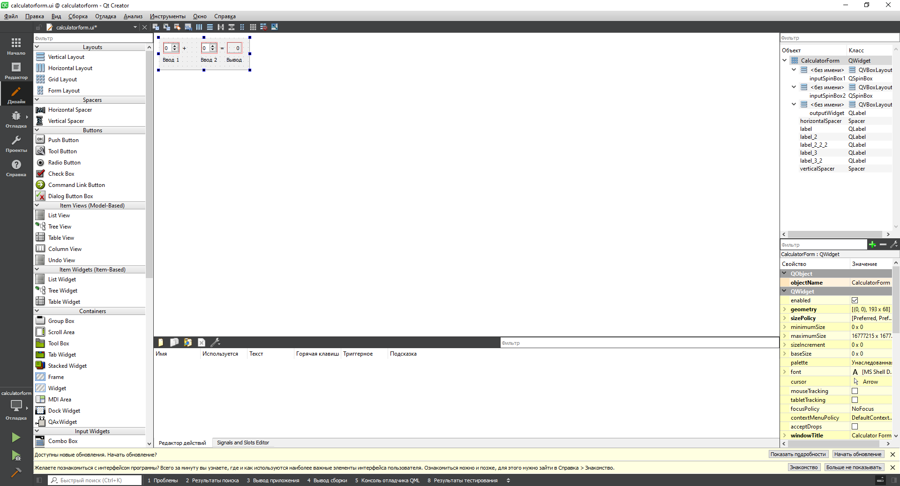

МИНИСТЕРСТВО НАУКИ  И ВЫСШЕГО ОБРАЗОВАНИЯ РОССИЙСКОЙ ФЕДЕРАЦИИ 
Федеральное государственное автономное образовательное учреждение высшего образования 
"КРЫМСКИЙ ФЕДЕРАЛЬНЫЙ УНИВЕРСИТЕТ им. В. И. ВЕРНАДСКОГО" 
ФИЗИКО-ТЕХНИЧЕСКИЙ ИНСТИТУТ 
Кафедра компьютерной инженерии и моделирования

 
<h3 align="center">Отчёт по лабораторной работе № 4  по дисциплине "Программирование"</h3>
  

студента 1 курса группы ПИ-б-о-202(2) 
Лыжин Игорь Дмитриевич 
направления подготовки 09.03.04 "Программная инженерия"

  
<table>
<tr><td>Научный руководитель  старший преподаватель кафедры  компьютерной инженерии и моделирования</td>
<td>(оценка)</td>
<td>Чабанов В.В.</td>
</tr>
</table>
  

Симферополь, 2020

## Цель:

1.  Установить фреймворк Qt;
2.  Изучить основные возможности создания и отладки программ в IDE Qt Creator.

### Постановка задачи

Настроить рабочее окружение, для разработки программного обеспечения при помощи Qt и IDE Qt Creator, а также изучить базовые возможности данного фреймворка.

## Выполнение работы
#### Задание 1
Я скачал с [официального сайта](https://www.qt.io/)  последнюю стабильную версию фреймворка Qt. Затем чтобы убедиться, что установка прошла успешно, запустил среду разработки Qt Creator и в разделе "Примеры" нашёл проект  *Calculator Form Example*. Далее на  боковой панели в разделе  в каталоге Формы я открыл главную форму проекта и замените текст "Input 1", "Input 2", "Output" на "Ввод 1", "Ввод 2" и "Вывод" соответственно. Скриншот показывающий выполнение задания (Рис 1.1).

 <i> Рисунок 1.1. Демонстрация редактора форм. </i> 

#### Задание 2
1. Как изменить цветовую схему (оформление) среды?

    1. Инструменты >> Параметры >> Среда
    2. Во вкладке интерфейс выбрать цветовую схему.
2. Как закомментировать/раскомментировать блок кода средствами Qt Creator? Имеется ввиду комбинация клавиш или пункт меню.
    1. Комбинация Cntr+/
3. Как открыть в проводнике Windows папку с проектом средствами Qt Creator?
    1. Вызвать контекстное меню нужного файла.
    2. Выбрать пункт "Показать в проводнике".
4. Какое расширение файла-проекта используется Qt Creator? Может быть несколько ответов.

    .pro
5. Как запустить код без отладки?

    Комбинация Cntr+R или нажать на кнопку "Запустить" в нижнем левом углу(Кнопка пуск).
6. Как запустить код в режиме отладки?
    1. Выбрать режим Отладки в левом нижнем углу.
    2. Нажать кнопку "Начать отладку запускающего проекта" в нижнем левом углу.(Кнопка пуск с жуком)
7. Как установить/убрать точку останова (breakpoint)?
    Точки останова устанавливаются/убираются кликом по нужной строке левее ее номера или в меню Отладка >> Поставить/снять точку останова, а также клавишей F9.
 #### Задание 3
 -   Чему равны переменные `i` и `d` в 6 строке;
 `i` = 0
  `d` = 8.3570769216278513e-317
-   Чему равны переменные `i` и `d` в 7 строке;
`i`=5
`d`=8.3570769216278513e-317
-   Чему равны переменные `i` и `d` в 8 строке;
`i`=5
`d`=5
## Вывод по работе. 

Цель работы была  достигнута. :
1.  Я установить фреймворк Qt;
2.  Изучил основные возможности создания и отладки программ в IDE Qt Creator.

