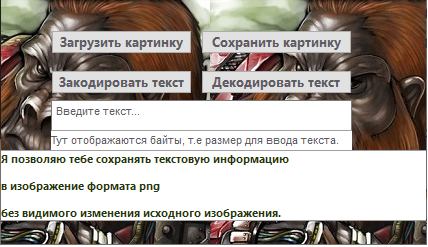

<p align="center">МИНИСТЕРСТВО НАУКИ  И ВЫСШЕГО ОБРАЗОВАНИЯ РОССИЙСКОЙ ФЕДЕРАЦИИ<br>
Федеральное государственное автономное образовательное учреждение высшего образования<br>
"КРЫМСКИЙ ФЕДЕРАЛЬНЫЙ УНИВЕРСИТЕТ им. В. И. ВЕРНАДСКОГО"<br>
ФИЗИКО-ТЕХНИЧЕСКИЙ ИНСТИТУТ<br>
Кафедра компьютерной инженерии и моделирования</p>
<br>
<h3 align="center">Отчёт по лабораторной работе № 5<br> по дисциплине "Программирование"</h3>
<br><br>
<p>студента 1 курса группы ПИ-б-о-202(2)<br>
Лыжин Игорь Дмитриевич<br>
направления подготовки 09.03.04 "Программная инженерия"</p>
<br><br>
<table>
<tr><td>Научный руководитель<br> старший преподаватель кафедры<br> компьютерной инженерии и моделирования</td>
<td>(оценка)</td>
<td>Чабанов В.В.</td>
</tr>
</table>
<br><br>
<p align="center">Симферополь, 2020</p>
<hr>

## Цель:

1.  Изучить базовые встроенные элементы фреймворка Qt предназначенные для создания приложений с графическим интерфейсом пользователя (GUI);
2.  Изучить сигнально-слотовую систему, как один из способов организации взаимодействия компонентов GUI;
3.  Получить практический навык работы с побитовыми операторами.


### Постановка задачи

Создать десктоп приложение с GUI позволяющее сохранять текстовую информацию в изображение формата _png_ без видимого изменения исходного изображения. Приложение должно позволять сохранять текст в картинку и извлекать текст из картинки.

## Выполнение работы
1. Перед началом создания алгоритма кодирования и декодирования текста из изображения я добавил 3 необходимые вещи: 1.  Создал слот, который выполнится при получении сигнала от кнопки. 2. Добавил возможность указывать путь к изображению которое нужно загрузить. 3. Добавил возможность загружать изображение в специальный объект-контейнер.
2.  Затем я приступил к созданию алгоритма на языке C++. Для кодирования последнего бита в один из цветов пикселя, я использовал побитовые сдвиги и операции сложения, умножения, для удобного записывания информации в картинку. Для декодирования полученной информации я воспользовался таким классом как QByteArray.
3. Для кодирования и декодирования информации из картинки в Python, я пользовался методами  python-строки, а именно encode() - позволяющий получить список байт в заданной кодировке (по умолчанию utf-8) и decode() - конвертирующий список байт в нужную нам кодировку строку.

<center> <i>Скриншот разработанного  графического интерфейса.</i></center>

 

<center> <i> Рисунок 1.1. Демонстрация окна  программы. </i> </center>

4. **Ответ на вопрос**: Зовут его **Rick Astley**, обещал **новый** трейлер **Grand Theft Auto VI**
5. Пример [картинки](https://raw.githubusercontent.com/FaeLeFly/Programming/master/Lab/lab5/image/pic2.png) с зашифрованным текстом 

Полный исходный код C++ приложения:
``` C++
#include "mainwindow.h"
#include "ui_mainwindow.h"
void MainWindow::LoadImage()
{
    QString fileName = QFileDialog::getOpenFileName(this, "Open Image", "", "Допустимые форматы (*.png)");
    if (image.load( fileName, "*png")){
        image.convertTo(QImage::Format_ARGB32);
        ui->label->setText("Изображение загружено");
        ui->label->setAlignment(Qt::Alignment(Qt::AlignCenter));
    }
    else{
        ui->label->setText("Изображение не загружено, увы и ах.");
        ui->label->setAlignment(Qt::Alignment(Qt::AlignCenter));
    }
    s=-100;
}

void MainWindow::encodeMsg()
{
    QString msg=ui->plainTextEdit->toPlainText();
    QByteArray msg8 =msg.toUtf8();
    unsigned long amsg =ui->plainTextEdit->toPlainText().toUtf8().size();

    int
            k3=14851492,
            count2=0,
            countup=0,
            iki=0,
            fff[32]{0},
            count = sizeof(fff)/sizeof(fff[0]);

    unsigned long g=msg8.size();

    for (int ij=count-1;ij>=0;ij--){
        if (g%2==1){
            fff[ij]=1;
        }
        g>>=1;
        if (g==0) break;
    }

    bool
            crit=true,
            flag=true;
    if(!image.isNull()){
    if (((image.width()*image.height()*3)/8-7)> amsg){
       for (int i=0;i<image.height();i++){
           for (int j=0;j<image.width();j++){
               QColor dec= image.pixelColor(j,i);

              unsigned int
                       red=dec.red(),
                       blue=dec.blue(),
                       green=dec.green();

               if (countup<24){
                   int bitIndex = 23 - countup % 24;

                   bool bit = (k3 >> bitIndex) % 2;

                   if(bit%2==1){
                       if (red%2==0){
                           red|=1;
                       }
                   }
                   else
                  {
                       if (red%2==1){
                           red>>=1;
                           red<<=1;
                       }
                   }
                   if(countup<24){
                       countup++;

                       bitIndex = 23 - countup % 24;
                       bit = (k3 >> bitIndex) % 2;
                       if(bit%2==1){
                           if (green%2==0){
                               green|=1;
                           }
                       }
                       else
                       {
                           if (green%2==1){
                               green>>=1;
                               green<<=1;
                           }
                       }
                   }
                   if(countup<24){
                       countup++;

                       bitIndex = 23 - countup % 24;
                       bit = (k3 >> bitIndex) % 2;
                       if(bit%2==1){
                           if (blue%2==0){
                               blue|=1;
                           }
                       }
                       else
                       {
                           if (blue%2==0){
                               blue>>=1;
                               blue<<=1;
                           }
                       }
                   }
                   countup++;
               }
               if (countup==25 && count2<count){
                       if (fff[count2]==0 && crit){
                           if (red%2==1){
                               red>>=1;
                               red<<=1;
                           }
                       }
                       else {
                           if (red%2==0 && crit){
                               red|=1;
                           }
                       }
                       count2++;

                       if (fff[count2]==0 && crit){
                           if (green%2==1){
                               green>>=1;
                               green<<=1;
                           }
                       }
                       else {
                           if (green%2==0 && crit){
                               green|=1;
                           }
                       }
                       count2++;
                       if (count2==count){
                           crit=false;
                           flag=false;
                       }

                       if (fff[count2]==0 && crit){
                           if (blue%2==1 && crit){
                               blue>>=1;
                               blue<<=1;
                           }
                       }
                       else {
                           if (blue%2==0 && crit){
                               blue|=1;
                           }
                       }
                       count2++;

               }
               if (countup==24) countup++;
               if (!crit && flag){
                   if (iki < (msg8.size() * 8)-1) {
                       iki++;
                   int
                           byteIndex = iki/8,
                           bitIndex = 7 - iki % 8;
                   bool bit = (msg8[byteIndex] >> bitIndex) % 2;
                       if (bit){
                           if (red%2==0){
                               red|=1;
                           }
                       }
                       else{
                           if (red%2==1){
                               red>>=1;
                               red<<=1;
                           }
                       }
                       if (iki < (msg8.size() * 8)-1){
                        iki++;                       
                        byteIndex = iki/8;
                        bitIndex = 7 - iki % 8;
                        bit = (msg8[byteIndex] >> bitIndex) % 2;
                       if (bit){
                           if (green%2==0){
                               green|=1;
                           }
                       }
                       else{
                           if (green%2==1){
                               green>>=1;
                               green<<=1;
                           }
                       }
                       }

                       if (iki < (msg8.size() * 8)-1){
                       iki++;
                       byteIndex = iki/8;
                       bitIndex = 7 - iki % 8;
                       bit = (msg8[byteIndex] >> bitIndex) % 2;

                       if (bit){
                           if (blue%2==0){
                               blue|=1;
                           }
                       }
                       else{
                           if (blue%2==1){
                               blue>>=1;
                               blue<<=1;
                           }
                       }
                       }

                   }
                   else break;

               }
               if (!flag){
                   if (iki < (msg8.size() * 8)-1){
                   int
                           byteIndex = iki/8,
                           bitIndex = 7 - iki % 8;
                   bool bit = (msg8[byteIndex] >> bitIndex) % 2;

                   if (bit){
                       if (blue%2==0){
                           blue|=1;
                       }
                   }
                   else{
                       if (blue%2==1){
                           blue>>=1;
                           blue<<=1;
                       }
                   }
                   }
                   flag=true;
               }
               dec.setRed(red);
               dec.setGreen(green);
               dec.setBlue(blue);
               image.setPixelColor(j,i,dec);
           }

       }
       ui->label->setText("Сообщение добавлено в изображение!");
    }
    else
        ui->label->setText("Недостаточный размер изображения");
    }
    else
    {
        ui->label->setText("Изображение не загружено");
    }
}
void MainWindow:: decodeMsg(){
    QByteArray msg,
               byte;

    int     k3[24]{1,1,1,0,0,0,1,0,1,0,0,1,1,1,0,1,1,0,1,0,0,1,0,0},
            countdown=24,
            countup=0,
            countdown2=32,
            sc=-1;

    int inc;
    char inctc;

    bool crit=true,
         vcrit=true,
         flag=true;

    char buffer=0;


    for (int i=0;i<image.height();i++){
        for (int j=0;j<image.width();j++){
            QColor dec= image.pixelColor(j,i);
            int red=dec.red(),blue=dec.blue(),green=dec.green();
            if (countdown!=0){
                if (k3[countup]==red%2)countdown--;
                countup++;
                if (k3[countup]==green%2)countdown--;
                countup++;
                if (k3[countup]==blue%2)countdown--;
                countup++;

            }

            if (countup>24) break;
            if (countdown==0 && !crit){
                if (countdown2 > 0){
                    if (red%2==0 && vcrit){
                        msg.push_back(static_cast<char>('0'));
                    }
                    else{
                        if (vcrit)
                            msg.push_back(static_cast<char>('1'));
                    }
               if (countdown2!=0)countdown2--;
               else vcrit=false;

               if (green%2==0 && vcrit){

                   msg.push_back(static_cast<char>('0'));
               }
               else{
                   if (vcrit)
                       msg.push_back(static_cast<char>('1'));
               }
               if (countdown2!=0)countdown2--;
               else vcrit=false;
               if (blue%2==0 && vcrit && countdown2!=0){
                   msg.push_back(static_cast<char>('0'));
               }
               else{
                   if (vcrit && countdown2 !=0)
                       msg.push_back(static_cast<char>('1'));
               }
               if (countdown2!=0)countdown2--;
               else vcrit=false;
                }

            }
            if (countdown==0 && crit) {
                crit=false;
            }
            if (countdown2==-1){
                if (sc!=0){
                    sc--;
                    inc=red%2;
                    inctc=inc+'0';
                    msg.push_back(static_cast<char>(inctc));
                }
                if (sc!=0){
                    sc--;
                    inc=green%2;
                    inctc=inc+'0';
                    msg.push_back(static_cast<char>(inctc));
                }
                if (sc!=0){
                    sc--;
                    inc=blue%2;
                    inctc=inc+'0';
                    msg.push_back(static_cast<char>(inctc));
                }
                }
            if (countdown2==0 && flag) {
                s=msg.toInt(nullptr,2);
                sc=msg.toInt(nullptr,2);
                sc*=8;
                flag=false;
                msg.remove(0,32);
                inc=blue%2;
                inctc=inc+'0';
                msg.push_back(static_cast<char>(inctc));
                sc--;
                countdown2--;
            }
            }
        if (countup>24)break;
        }
    if (sc==0){
        for (int i=0;i < msg.size();i++){

            buffer=(buffer<<1)|(msg[i]-'0');
            if (i%8==7){
                byte.push_back(buffer);
                buffer=0;
            }
        }
    }
    if (countdown!=0 || countup>24){
        ui->label->setText("Сообщение не обнаружено");
    }
    else{
        ui->label->setText(QString("Присутствует сообщение длиной %1 байт").arg(s));
        ui->plainTextEdit->setPlainText(QString::fromUtf8(byte));
    }
}
void MainWindow::saveMsg(){
     QString fileName;
     if (image.isNull()){
         QMessageBox msgBox;
         msgBox.setModal(true);
         msgBox.setWindowFlags(Qt::FramelessWindowHint);
         msgBox.setIcon(QMessageBox::Critical);
         msgBox.setText("Сначала загрузите изображение!");
         msgBox.setWindowTitle("About");
         msgBox.exec();
     }
     else fileName = QFileDialog::getSaveFileName(this, "Save File","","Допустимые форматы(*.png )");
    if (fileName.isNull() || image.isNull()){
        ui->label->setText("Изображение не сохранено,\n проверьте имя файла или загрузите его снова");
    }
    else{
    image.save(fileName,"png");
    ui->label->setText("Изображение успешно сохранено!");
    ui->label->setAlignment(Qt::Alignment(Qt::AlignCenter));
    }
}

void MainWindow::msgChanged()
{
    if (s!=-100){
    unsigned long gf=ui->plainTextEdit->toPlainText().toUtf8().size();
    char32_t size =(image.width()*image.height()*3)/8-7 ;
    if (gf<= size)
    ui->label_5->setText(QString("Ещё можно ввести %1 байт").arg(size-gf));
    else
        ui->label_5->setText(QString("Недостаточно места, уберите %1 ,байт").arg(-1*(size-gf)));
    }
    else {
        ui->label_5->setText(QString("Тут отображаются байты, т.е размер для ввода текста."));
    }
}
MainWindow::MainWindow(QWidget *parent)
    : QMainWindow(parent)
    , ui(new Ui::MainWindow)
{
    ui->setupUi(this);
    connect(ui->pushButton, &QPushButton::clicked, this, &MainWindow::LoadImage);
    connect(ui->pushButton_2, &QPushButton::clicked, this, &MainWindow::encodeMsg);
    connect(ui->pushButton_3, &QPushButton::clicked, this, &MainWindow::saveMsg);
    connect(ui->pushButton_4, &QPushButton::clicked, this, &MainWindow::decodeMsg);
    connect(ui->plainTextEdit, &QPlainTextEdit::textChanged, this, &MainWindow::msgChanged);
}

MainWindow::~MainWindow()
{
    delete ui;
}


```
Полный исходный код Python приложения:
``` Python
from ui_mainwindow import *


class MainWindow(QMainWindow):
    def __init__(self):
        super(MainWindow, self).__init__()
        self.ui = Ui_MainWindow()
        self.ui.setupUi(self)
        self.ui.pushButton.clicked.connect(self.loadImage)
        self.image = QImage()
        self.ui.pushButton_3.clicked.connect(self.saveImage)
        self.msgBox = QMessageBox()
        self.ui.pushButton_2.clicked.connect(self.encodeMsg)
        self.ui.pushButton_4.clicked.connect(self.decodeMsg)
        self.ui.plainTextEdit.textChanged.connect(self.msgChanged)
        self.dec = QColor()

    @Slot()
    def loadImage(self):
        fileName, _ = QFileDialog.getOpenFileName(self, "Open Image", "", "Доступные форматы (*.png)")
        if self.image.load(fileName, "*png"):
            self.image.convertTo(QImage.Format_ARGB32)
            self.ui.label.setText("Изображение загружено")
            self.ui.label.setAlignment(Qt.AlignCenter)
        else:
            self.ui.label.setText("Изображение не загружено")
            self.ui.label.setAlignment(Qt.AlignCenter)

    @Slot()
    def saveImage(self):
        if self.image == None:
            self.msgBox.setModal(True)
            self.msgBox.setWindowFlags(Qt.FramelessWindowHint)
            self.msgBox.setIcon(QMessageBox.Critical)
            self.msgBox.setText("Сначала загрузите изображение!")
            self.msgBox.exec_()
        else:
            fileName, _ = QFileDialog.getSaveFileName(self, "Save File", "", "Допустимые форматы (*.png)")
        if self.image == None:
            self.ui.label.setText("Изображение не сохранено,\n проверьте имя файла или загрузите его снова")
        else:
            self.image.save(fileName)
            self.ui.label.setText("Изображение успешно сохранено!")

    @Slot()
    def msgChanged(self):
        if self.image != None:
            msg = len(self.ui.plainTextEdit.toPlainText().encode("utf-8"))
            size = (self.image.width() * self.image.height() * 3) / 8 - 7;
            if (msg<=size):
                self.ui.label_5.setText(f"Ещё можно ввести {int(size-msg)} байт")
            else:
                self.ui.label_5.setText(f"Недостаточно места, уберите {int(-1*(size-msg))} байт")
        else:
            self.ui.label_5.setText("Тут отображаются байты, т.е размер для ввода текста.")
    @Slot()
    def encodeMsg(self):
        msg = self.ui.plainTextEdit.toPlainText()
        sigil = [1, 1, 1, 0, 0, 0, 1, 0, 1, 0, 0, 1, 1, 1, 0, 1, 1, 0, 1, 0, 0, 1, 0, 0]
        msg = msg.encode("utf-8")
        mmsgSize = 0
        byte = 0
        deil = 0
        AA = []
        depth = int(bin(len(msg))[2:])
        for i in range(32):
            if depth > 0:
                AA.append(int(depth % 2))
                depth /= 10
            else:
                AA.append(0)
        AA.reverse()
        countup = 0
        countdown = 0
        dred = ''
        dgreen = ''
        dblue = ''
        breaks=True
        if not self.image == None:
            if self.image.width() * self.image.height() * 3 / 8 - 7 > len(msg):
                for i in range(self.image.height()):
                    for j in range(self.image.width()):
                        self.dec = self.image.pixelColor(j, i)
                        red, green, blue = bin(self.dec.red())[2:], bin(self.dec.green())[2:], bin(self.dec.blue())[2:]
                        if countup < len(sigil):
                            dred = red[:len(red) - 1]
                            dred += str(sigil[countup])
                            countup += 1
                            dgreen = green[:len(green) - 1]
                            dgreen += str(sigil[countup])
                            countup += 1
                            dblue = blue[:len(blue) - 1]
                            dblue += str(sigil[countup])
                            countup += 1

                        if countup == 25 and countdown < 32:
                            dred = red[:len(red) - 1]
                            dred += str(AA[countdown])
                            countdown += 1
                            dgreen = green[:len(green) - 1]
                            dgreen += str(AA[countdown])
                            countdown += 1
                            if countdown < 32:
                                dblue = blue[:len(blue) - 1]
                                dblue += str(AA[countdown])
                                countdown += 1

                        if countdown == 33 and breaks:
                            if breaks:
                                deil+=1
                                byte = bin(msg[mmsgSize])[2:]
                                if len(byte) < 8:
                                    while len(byte) < 8:
                                        byte = '0' + byte
                                dred = red[:len(red) - 1]
                                dred += byte[deil]
                                if deil == 7:
                                    mmsgSize += 1
                                    if mmsgSize >= len(msg): breaks=False
                                    deil = -1
                            if breaks:
                                deil += 1
                                byte = bin(msg[mmsgSize])[2:]
                                if len(byte) < 8:
                                    while len(byte) < 8:
                                        byte = '0' + byte
                                dgreen = dgreen[:len(dgreen) - 1]
                                dgreen += byte[deil]
                                if deil == 7:
                                    mmsgSize += 1
                                    if mmsgSize >= len(msg): breaks=False
                                    deil = -1
                            if breaks:
                                deil += 1
                                byte = bin(msg[mmsgSize])[2:]
                                if len(byte) < 8:
                                    while len(byte) < 8:
                                        byte = '0' + byte
                                dblue = blue[:len(blue) - 1]
                                dblue += byte[deil]
                                if deil == 7:
                                    mmsgSize += 1
                                    if mmsgSize >=len(msg): breaks=False
                                    deil = -1
                        if countdown == 32:
                            byte = bin(msg[mmsgSize])[2:]
                            if len(byte) < 8:
                                while len(byte) < 8:
                                    byte = '0' + byte
                            dblue = blue[:len(blue) - 1]
                            dblue += byte[deil]
                            countdown += 1
                        if countup == 24: countup += 1
                        self.dec.setRed(int(dred, 2))
                        self.dec.setGreen(int(dgreen, 2))
                        self.dec.setBlue(int(dblue, 2))
                        self.image.setPixelColor(j, i, self.dec)
                        if not breaks: break

                    if mmsgSize >= len(msg) or not breaks: break

                self.ui.label.setText("Сообщение добавлено в изображение!")
            else:
                self.ui.label.setText("Недостаточный размер изображения!")
        else:
            self.ui.label.setText("Изображение не загружено!")

    @Slot()
    def decodeMsg(self):
        sigil = [1, 1, 1, 0, 0, 0, 1, 0, 1, 0, 0, 1, 1, 1, 0, 1, 1, 0, 1, 0, 0, 1, 0, 0]
        countdown = 24
        countup = 0
        countdown2 = 32
        sc = -1
        mSize = ''
        msgSize = 0
        box = []
        encode_text = ''
        decode_text = bytearray()
        count = 0
        crit, vcrit, flag = True, True, True
        for i in range(self.image.height()):
            for j in range(self.image.width()):
                self.dec = self.image.pixelColor(j, i)
                red, green, blue = self.dec.red(), self.dec.green(), self.dec.blue()
                if countup >24: break
                if countdown > 0:
                    if sigil[countup] == red % 2: countdown -= 1
                    else:
                        countup=-1
                        break
                    countup += 1
                    if sigil[countup] == green % 2: countdown -= 1
                    else:
                        countup = -1
                        break
                    countup += 1
                    if sigil[countup] == blue % 2: countdown -= 1
                    else:
                        countup = -1
                        break
                    countup += 1

                if countdown == 0 and not crit:
                    if countdown2 > 0:
                        box.append(str(red % 2))
                        countdown2 -= 1
                        box.append(str(green % 2))
                        countdown2 -= 1
                        if countdown2 != 0:
                            box.append(str(blue % 2))
                            countdown2 -= 1
                if countdown == 0 and crit:
                    crit = False
                if countdown2 == -1:
                    if count == 8:
                        encode_text += ' '
                        count = 0
                    if sc != 0:
                        sc -= 1
                        encode_text += str(red % 2)
                        count += 1
                    if count == 8:
                        encode_text += ' '
                        count = 0
                    if sc != 0:
                        sc -= 1
                        encode_text += str(green % 2)
                        count += 1
                    if count == 8:
                        encode_text += ' '
                        count = 0
                    if sc != 0:
                        sc -= 1
                        encode_text += str(blue % 2)
                        count += 1
                if countdown2 == 0 and flag:
                    mSize = mSize.join(box)
                    sc = int(mSize, 2)
                    msgSize = sc
                    sc *= 8
                    flag = False
                    encode_text += str(blue % 2)
                    sc -= 1
                    countdown2 -= 1
                    count += 1
            if countup > 24 or countup==-1: break
        if sc == 0:
            for i in encode_text.split():
                decode_text += bytes(int(i[j: j + 8], 2) for j in range(0, len(i), 8))
            decode_text = decode_text.decode()
        if countdown != 0 or countup >24 or countup==-1:
            self.ui.label.setText("Собщение не обнаружено!")
        else:
            self.ui.label.setText(f"Присутствует сообщение длиной {msgSize} байт")
            self.ui.plainTextEdit.setPlainText(decode_text)


if __name__ == "__main__":
    import sys

    app = QApplication(sys.argv)

    window = MainWindow()
    window.show()

    sys.exit(app.exec_())
```

## Вывод по работе. 

Цель работы была  достигнута. :

1.  Я изучил базовые встроенные элементы фреймворка Qt предназначенные для создания приложений с графическим интерфейсом пользователя (GUI);
2.  Также изучил  сигнально-слотовую систему, как один из способов организации взаимодействия компонентов GUI;
3. Получил практический навык работы с побитовыми операторами.
